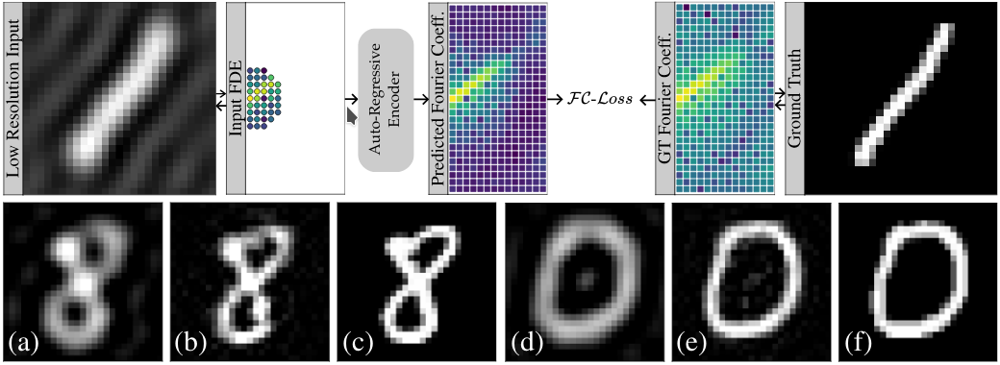
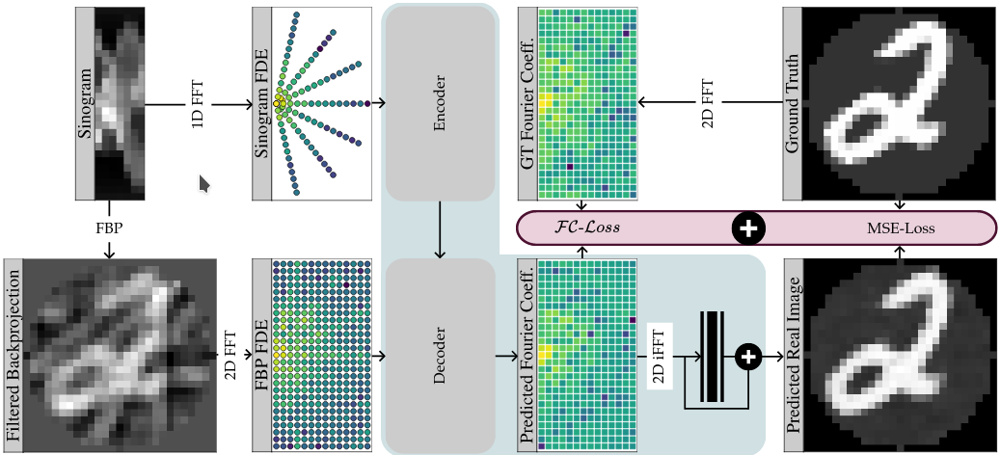

# Fourier Image Transformer

Tim-Oliver Buchholz<sup>1</sup> and Florian Jug<sup>2</sup></br>
<sup>1</sup>tibuch@mpi-cbg.de, <sup>2</sup>florian.jug@fht.org

Transformer architectures show spectacular performance on NLP tasks and have recently also been used for tasks such as
image completion or image classification. Here we propose to use a sequential image representation, where each prefix of
the complete sequence describes the whole image at reduced resolution. Using such Fourier Domain Encodings (FDEs), an
auto-regressive image completion task is equivalent to predicting a higher resolution output given a low-resolution
input. Additionally, we show that an encoder-decoder setup can be used to query arbitrary Fourier coefficients given a
set of Fourier domain observations. We demonstrate the practicality of this approach in the context of computed
tomography (CT) image reconstruction. In summary, we show that Fourier Image Transformer (FIT) can be used to solve
relevant image analysis tasks in Fourier space, a domain inherently inaccessible to convolutional architectures.

Preprint: [arXiv](https://arxiv.org/abs/2104.02555)

## FIT for Super-Resolution



__FIT for super-resolution.__ Low-resolution input images are first transformed into Fourier space and then unrolled
into an FDE sequence, as described in Section 3.1 of the paper. This FDE sequence can now be fed to a FIT, that,
conditioned on this input, extends the FDE sequence to represent a higher resolution image. This setup is trained using
an FC-Loss that enforces consistency between predicted and ground truth Fourier coefficients. During inference, the FIT
is conditioned on the first 39 entries of the FDE, corresponding to (a,d) 3x Fourier binned input images. Panels (b,e)
show the inverse Fourier transform of the predicted output, and panels (c,f) depict the corresponding ground truth.

## FIT for Tomography



__FIT for computed tomography.__ We propose an encoder-decoder based Fourier Image Transformer setup for tomographic
reconstruction. In 2D computed tomography, 1D projections of an imaged sample (i.e. the columns of a sinogram) are
back-transformed into a 2D image. A common method for this transformationis the filtered backprojection (FBP). Since
each projection maps to a line of coefficients in 2D Fourier space, a limited number of projections in a sinogram leads
to visible streaking artefacts due to missing/unobserved Fourier coefficients. The idea of our FIT setup is to encode
all information of a given sinogram and use the decoder to predict missing Fourier coefficients. The reconstructed image
is then computed via an inverse Fourier transform (iFFT) of these predictions. In order to reduce high frequency
fluctuations in this result, we introduce a shallow conv-block after the iFFT (shown in black). We train this setup
combining the FC-Loss, see Section 3.2 in the paper, and a conventional MSE-loss between prediction and ground truth.

## Installation

We use [fast-transformers](https://github.com/idiap/fast-transformers) as underlying transformer implementation. In our super-resolution experiments we use their
`causal-linear` implementation, which uses custom CUDA code (prediction works without this custom code). This code is
compiled during the installation of fast-transformers and it is necessary that CUDA and NVIDIA driver versions match.
For our experiments we used CUDA 10.2 and NVIDIA driver 440.118.02.

We recommend to install Fast Image Transformer into a new [conda](https://docs.conda.io/en/latest/miniconda.html)
environment:

`conda create -n fit python=3.7`

Next activate the new environment.:

`conda activate fit`

Then we install PyTorch for CUDA 10.2:

`conda install pytorch torchvision torchaudio cudatoolkit=10.2 -c pytorch`

Followed by installing fast-transformers:

`pip install --user pytorch-fast-transformers`

Now we have to install the `astra-toolbox`:

`conda install -c astra-toolbox/label/dev astra-toolbox`

And finally we install Fourier Image Transformer:

`pip install fourier-image-transformer`

Start the jupyter server:

`jupyter notebook`


## Cite
```
@misc{buchholz2021fourier,
      title={Fourier Image Transformer}, 
      author={Tim-Oliver Buchholz and Florian Jug},
      year={2021},
      eprint={2104.02555},
      archivePrefix={arXiv},
      primaryClass={cs.CV}
}
```
